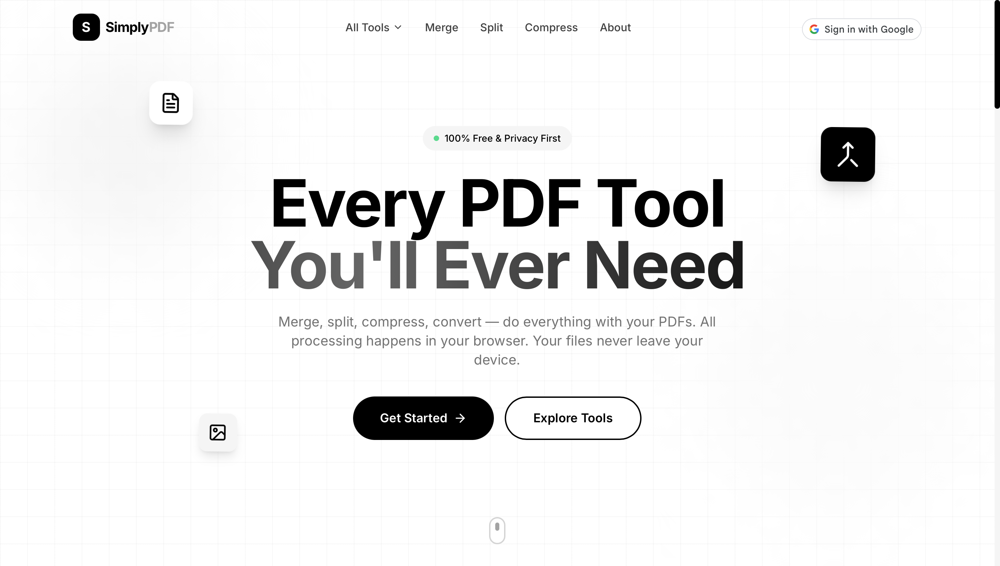
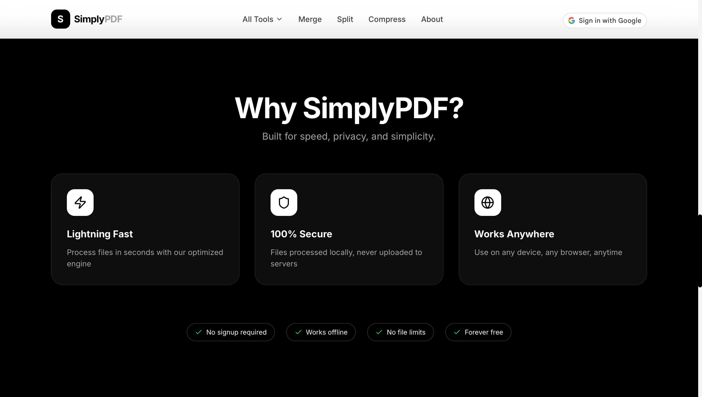
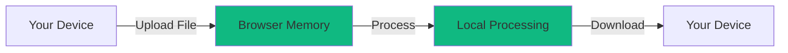

<div align="center">


# 📄 SimplyPDF

### *The Ultimate Premium Suite for Your PDF Needs*

[](https://simplypdf.vercel.app)
[](https://github.com/ArshVermaGit)
[](LICENSE)

---

### ✨ **100% Free • Privacy-First • Lightning Fast** ✨

*SimplyPDF is a state-of-the-art web application designed to handle complex PDF tasks directly in your browser. With a focus on **Privacy-First Architecture**, your files never touch a server—everything is processed locally on your machine.*

[🚀 Launch App](https://simplypdf.vercel.app) • [📖 Documentation](#-getting-started) • [⭐ Star on GitHub](https://github.com/ArshVermaGit/SimplyPDF)

</div>

---

## 🎨 Visual Experience

### **Modern • Premium • Aesthetic**

SimplyPDF isn't just a tool; it's a **premium experience**. Featuring **Animated Backgrounds**, **Floating 3D Decorations**, and **Smooth Framer Motion Transitions**, we've brought high-end design to document management.

<div align="center">

| 🏠 **Landing Page** | 🖼️ **PDF to JPG** |
|:---:|:---:|
|  |  |

| 🔍 **Features Overview** | 🎨 **Premium Design** |
|:---:|:---:|
|  |  |

</div>

---

## ✨ Features at a Glance

SimplyPDF packs **16+ powerful tools** into one seamless interface:

<div align="center">

| Category | Features |
|:---|:---|
| 🔄 **Conversions** | Word ↔️ PDF • Excel ↔️ PDF • JPG ↔️ PDF • PNG to PDF |
| 🔍 **AI-Powered OCR** | Extract text from scanned documents using industry-leading AI |
| 🔐 **Security** | Password-protect files • Remove restrictions with a click |
| ✍️ **Editing Suite** | Add text • Draw shapes • Digital signatures • Custom watermarks |
| ⚡ **Optimization** | Compress file sizes without losing quality |
| 📂 **Organization** | Merge • Split • Rotate • Reorder pages intuitively |

</div>

---

## 🛠️ Tech Stack

Built with a modern, high-performance stack for a seamless user experience:

<div align="center">


</div>

**Core Libraries:**
- **Frontend Framework:** [Next.js 14+](https://nextjs.org/) with App Router
- **Styling:** [Tailwind CSS](https://tailwindcss.com/)
- **Animations:** [Framer Motion](https://www.framer.com/motion/)
- **PDF Processing:** `pdf-lib`, `pdfjs-dist`
- **OCR Engine:** `tesseract.js`
- **Document Export:** `docx` (Word), `xlsx` (Excel)

---

## 🔒 Privacy Architecture

SimplyPDF treats your privacy as the **#1 feature**:

<div align="center">



</div>

| Feature | Description |
|:---|:---|
| 🏠 **Local Processing** | All file manipulations occur in your browser's RAM |
| 🚫 **No Cloud Storage** | We don't have a backend that stores your documents |
| 🔓 **No Signup Required** | Start working immediately without giving away personal info |
| 🗑️ **Auto-Delete** | Files are cleared from memory when you close the tab |

---

## 🚀 Getting Started

### Quick Start (Run Locally)

```bash
# 1. Clone the repository
git clone https://github.com/ArshVermaGit/SimplyPDF.git

# 2. Navigate to project directory
cd SimplyPDF

# 3. Install dependencies
npm install

# 4. Launch development server
npm run dev
```

Open `http://localhost:3000` to start using SimplyPDF locally!

### Or Try It Live

**👉 [Launch SimplyPDF](https://simplypdf.vercel.app) - No installation needed!**

---

## 📸 Screenshots

<div align="center">

### Modern Interface with Premium Animations


*Experience smooth transitions, floating elements, and an intuitive drag-and-drop interface*

</div>

---

## 🤝 Contributing

Contributions are welcome! Feel free to:

1. 🐛 Report bugs
2. 💡 Suggest new features
3. 🔧 Submit pull requests
4. ⭐ Star the repository

---

## 👨‍💻 Developed by Arsh Verma

*Full-Stack Digital Creator & Tech Gaming Technology Student at VIT Bhopal*

I'm passionate about blending technical precision with creative vision to build exceptional digital experiences.

<div align="center">

[](https://arshcreates.vercel.app/)
[](https://www.linkedin.com/in/arshvermadev/)
[](https://x.com/TheArshVerma)
[](mailto:Arshverma.dev@gmail.com)

</div>

---

## 📜 License

This project is licensed under the **MIT License** - see the [LICENSE](LICENSE) file for details.

---

<div align="center">

### ⭐ **Loved SimplyPDF? Give it a Star!** ⭐

*Built with ❤️ by [Arsh Verma](https://github.com/ArshVermaGit)*


---

**[⬆ Back to Top](#-simplypdf)**

</div>